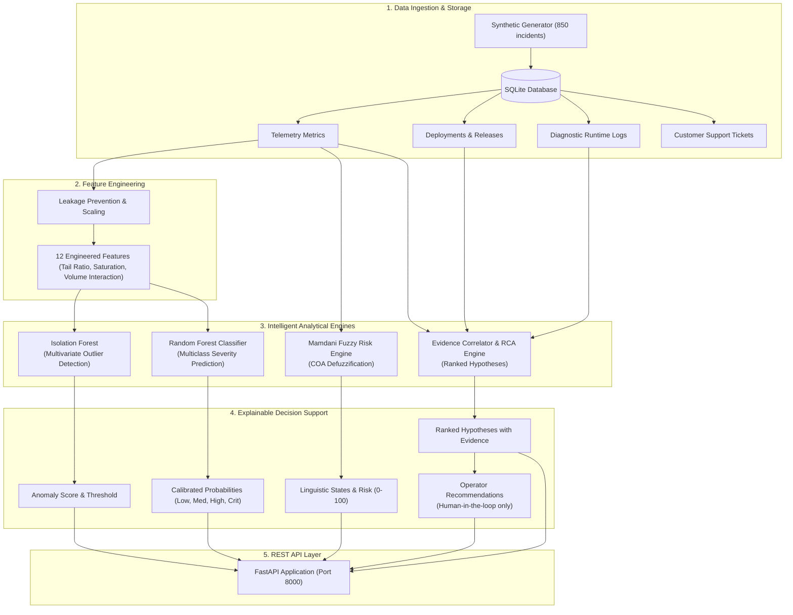

# IntelliIncident Backend

**Academic Project Title**:
*AI/ML and Soft Computing Based Intelligent Incident Detection, Risk Assessment and Root Cause Analysis System*

IntelliIncident is an engineering operations intelligence backend designed for SREs, DevOps teams, and incident response engineers. It combines Machine Learning, Soft Computing, and Evidence-Based Root Cause Analysis into a unified, explainable decision-support platform.

---

## 1. System Architecture



---

## 2. Key Modules & Methodologies

### 2.1 Machine Learning Pipeline
- **Isolation Forest (`backend/app/ml/anomaly_detector.py`)**:
  - Unsupervised decision-tree ensemble isolating rare telemetry anomalies in multivariate space using scikit-learn.
  - Computes anomaly scores and evaluates distance against nominal baseline means.
  - **Strict No-Fallback Policy**: If the trained `.joblib` model artifact is unavailable, the detector raises an explicit error and returns HTTP 503 rather than silently substituting mock heuristics.
- **Random Forest Multiclass Classifier (`backend/app/ml/severity_classifier.py`)**:
  - Classifies incident severity into `LOW`, `MEDIUM`, `HIGH`, `CRITICAL` using scikit-learn.
  - Computes calibrated class probabilities and Gini feature importances.
  - Model serialization via Joblib to `backend/models/`.
  - **Strict No-Fallback Policy**: Requires genuine trained model artifacts; never returns mock predictions.
- **Target Leakage Prevention**:
  - Feature extraction (`backend/app/ml/feature_engineering.py`) explicitly excludes target labels (`severity`, `risk_score`, `risk`) from feature matrices.

### 2.2 Soft Computing Fuzzy Risk Assessment Engine
- **scikit-fuzzy Implementation (`backend/app/fuzzy/`)**:
  - Powered explicitly by the `scikit-fuzzy` (`skfuzzy`) library.
  - **Universes of Discourse & Memberships**: Evaluates continuous triangular (`skfuzzy.membership.trimf`) and trapezoidal (`skfuzzy.membership.trapmf`) curves across 5 input universes:
    - Error Rate: `LOW`, `MEDIUM`, `HIGH`
    - User Impact: `LOW`, `MEDIUM`, `HIGH`
    - P99 Latency: `LOW`, `MEDIUM`, `HIGH`
    - Deployment Recency: `RECENT`, `MODERATE`, `OLD`
    - Service Criticality: `LOW`, `MEDIUM`, `HIGH`
  - Output Risk Universe: `LOW`, `MEDIUM`, `HIGH`, `VERY_HIGH`.
  - **Mamdani Min-Max Inference**:
    - Evaluates antecedent membership degrees using `skfuzzy.interp_membership`.
    - Min-conjunction: $w_i = \min_j \mu_{A_{ij}}(x_j)$.
    - Mamdani implication: $\mu_{C_i}(z) = \min(w_i, \mu_{C}(z))$.
    - Rule aggregation: $\mu_{\text{agg}}(z) = \max_i \mu_{C_i}(z)$.
  - **Centroid Defuzzification (`skfuzzy.defuzz`)**:
    $$z^* = \frac{\int z \cdot \mu_{\text{agg}}(z) dz}{\int \mu_{\text{agg}}(z) dz}$$
    Executed directly via `skfuzzy.defuzz(universe, mfx, 'centroid')`.
  - **Explainability**: Reports triggered rules, activation weights ($w_i \in [0, 1]$), and qualitative contributions for incident root cause and risk comprehension.

### 2.3 Evidence-Based Root Cause Analysis & Playbook Recommendations
- **RCA Engine (`backend/app/rca/`)**:
  - Evaluates 6 causal hypotheses: `DEPLOYMENT`, `DATABASE`, `INFRASTRUCTURE`, `CODE_ERROR`, `TRAFFIC`, `NETWORK`.
  - Correlates deployment timestamps, query wait times, stack traces, and ticket surges.
- **Operator Safety (No Automatic Execution)**:
  - IntelliIncident is strictly an analysis platform. It **never** executes remediation commands automatically.
  - All commands are clearly labeled as `Operator action (Suggested command)` for manual human review and execution.

---

## 3. REST API Reference

| Method | Endpoint | Description |
|---|---|---|
| `GET` | `/api/health` | Service health status, ML model readiness, fuzzy engine status |
| `GET` | `/api/incidents` | Query incident catalog with search and multi-property filters |
| `GET` | `/api/incidents/{id}` | Detailed incident record with metrics, ML scores, fuzzy risk, and RCA |
| `POST` | `/api/analyze/{id}` | Execute end-to-end incident intelligence pipeline dynamically |
| `GET` | `/api/ml/metrics` | Trained Random Forest accuracy, precision, recall, and macro F1 |
| `GET` | `/api/ml/features` | Ranked Gini feature importances for explainability |
| `POST` | `/api/fuzzy-risk` | Real-time Mamdani fuzzy risk evaluation from crisp inputs |
| `GET` | `/api/root-cause/{id}` | Ranked root cause hypotheses and supporting evidence |
| `GET` | `/api/reports/{id}` | Formal post-mortem dossier payload |

---

## 4. Setup & Running Instructions

### 4.1 Prerequisites
- Python 3.12+
- Dependencies installed:
  ```powershell
  python -m pip install -r backend/requirements.txt
  ```

### 4.2 Seed Dataset & Train Models
```powershell
# 1. Generate realistic noisy incident telemetry
python backend/data/generate_dataset.py

# 2. Seed SQLite database
python backend/data/seed_data.py

# 3. Train Isolation Forest and Random Forest models
python backend/ml_training/train_models.py
```

### 4.3 Run Test Suite
```powershell
python -m pytest backend/tests/ -v
```

### 4.4 Start FastAPI Server
```powershell
python -m uvicorn backend.app.main:app --host 0.0.0.0 --port 8000 --reload
```
Interactive OpenAPI documentation will be accessible at: `http://localhost:8000/docs`.
